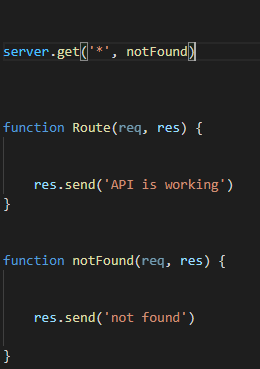
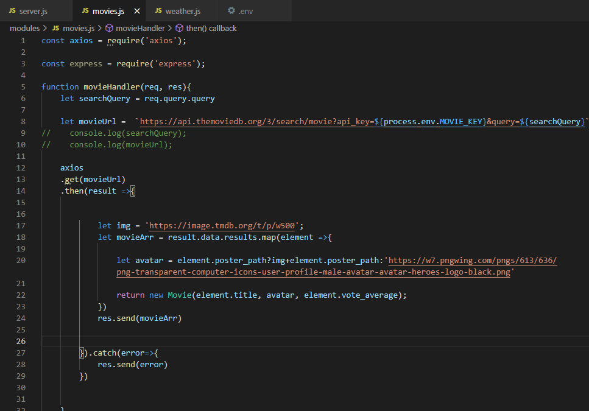
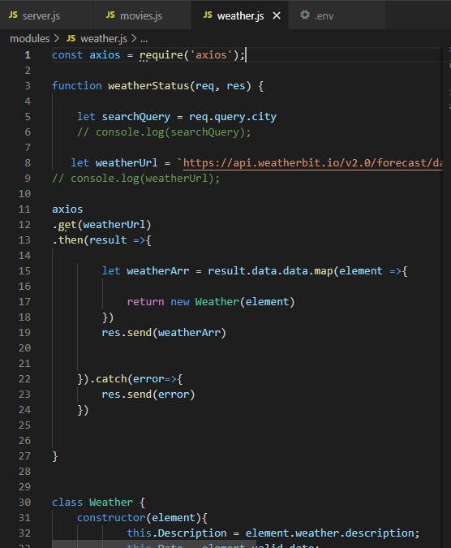
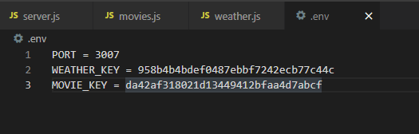
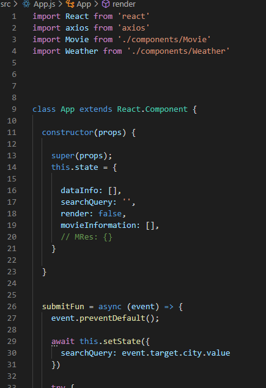
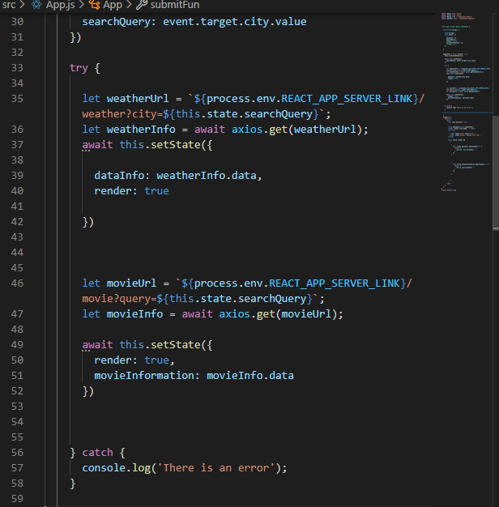
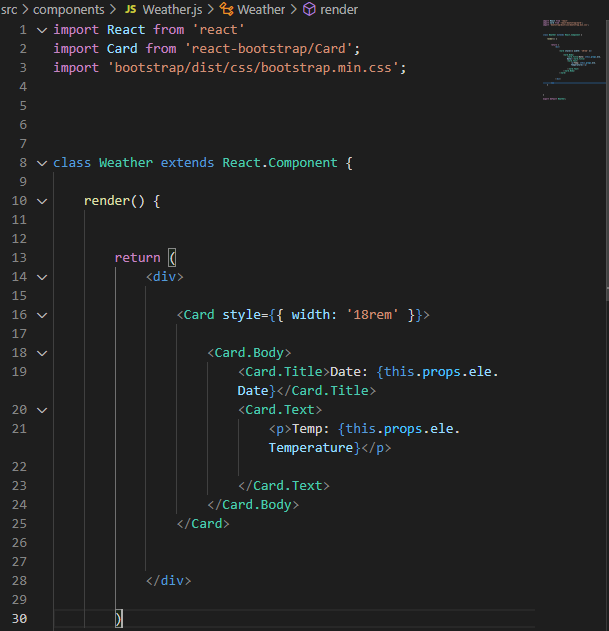
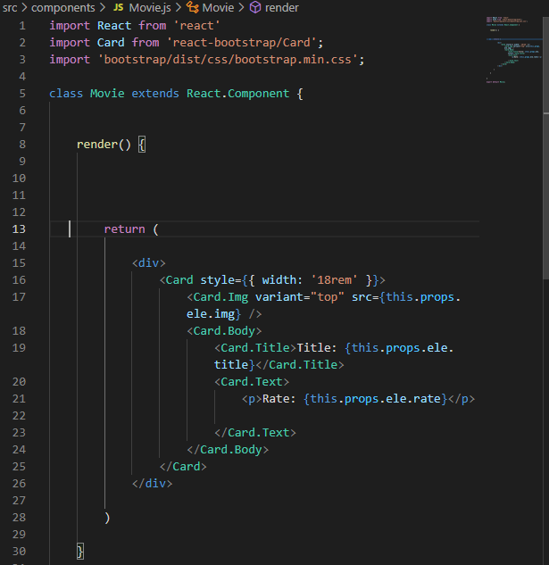
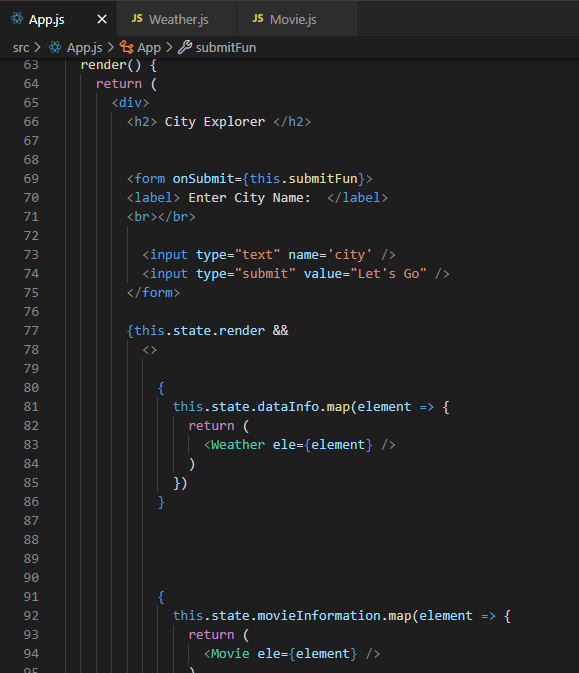

# **White Box Testing**

## First thing, in our assignment we should have two repositories, one of them for ***the frontend*** and the other one for ***the backend***.

### Now, lets talk about both.

- ## **Backend testing**

**Waht is backend?**

The back end refers to parts of a computer application or program code that permits it to figure and isn't accessible to the user. The backend is additionally called the info access layer for programs or devices and includes any function that has got to be accessed and mobile by digital means.

**In this image as you can see if there is any problem with the Server URL the resault is gonna be "not found" but if there is no problem resault is gonna be "API is working"**
____

### let's see from where we get the data

**Here is *movies and weather* pages that we can get the live data we want from *TMDB API* and *Weather API***

___
___
___
### When someone want to send a request by URL, the URL should include his/her own API key to get data. Here we have the API keys in `.env`, let me tell you why we should add the keys and our own info in this `.env` file. Because we want to use them in our code and the good thing that if we pushed our code to ***GitHub*** or somewhere, this `.env` file will not be able to be with your work that nobody can use your keys.

### `Let's see how I added my keys and how I used them in URL`

**For example the movie key**

____
____
____
- ## **Frontend**

**What is Frontend?**

Front-end development manages everything users see visually first in their browser or app. You manage what people see first in their browser. As a front-end developer, you are responsible for the shape, style, and design of the site at the end.

**Let's take look at the code**

**As you can see here is `App.js` page ,`App.js` on the other hand has the root component of the react app because every view and component are handled with hierarchy in React, where <App /> is the top most component in the hierarchy. This gives you the feeling that you maintain hierarchy in your code starting from App. js**

**Any code, libraries, components or CSS related to `App`, you must import it as you can see at the top of the code**

____
____
____

**The `try...catch` statement marks a block of statements to try and specifies a response should an exception be thrown.**

**try statements:**
The statements to be executed.

**catch statements:**
A statement that is executed if an exception is thrown in the try-block.

___
___
___

**In these components, the weather and the movie, we have added the data that should appear to the user when searching, such as:**

**The film includes this data (title and rating)
Weather includes this data (date and tempreture)**

**lsat thing, we have to render them in the parent page (`App.js`) like this:**

